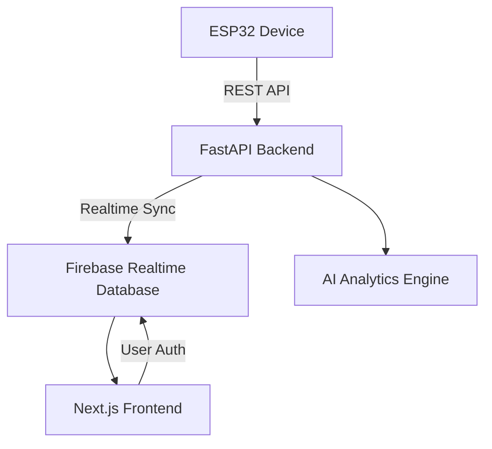

# 🩺 Heart Rate & SpO₂ Monitoring System

A smart health monitoring solution powered by **ESP32**, collecting **Heart Rate** and **SpO₂ (Blood Oxygen)** data, integrated with **AI-driven analytics** to provide **personalized health insights**.
Built with a **modern full-stack architecture**:
⚡ Next.js (frontend) · 🚀 FastAPI (backend) · ☁️ Firebase (database & auth)

---

## 🔎 Overview

This project enables:
---

* **📡 Real-time monitoring** — ESP32 streams Heart Rate & SpO₂ data securely to the cloud
* **🤖 AI analytics** — Detect anomalies, analyze trends, and assess health risks
* **💡 Personalized insights** — Lifestyle advice & early warnings
* **📊 Visualization** — Dashboards, trend charts, and periodic health reports

---

## ⚙️ Key Features

* 🔐 **User & Device Authentication** — Firebase Auth + secure device registration
* 📡 **Data Collection** — ESP32 → REST API → Firebase
* ⚡ **AI-powered Analysis** — Trend detection & anomaly alerts
* 📊 **Interactive Dashboard** — Personal health metrics in real time
* 📜 **Command Management** — Send instructions to IoT devices
* 🌍 **Cross-platform** — Works across devices with CORS-enabled endpoints

---

## 🏗️ Architecture



* **Frontend**: Next.js + TypeScript (UI & Dashboard)
* **Backend**: FastAPI + Firebase Admin SDK (APIs & analytics)
* **Database**: Firebase Realtime Database (real-time sync)
* **Deployment**: Vercel (serverless, auto-scale)

---

## 🚀 Getting Started

### 📦 Prerequisites

* Node.js ≥ 18
* Python ≥ 3.8
* Firebase project (Realtime DB + Auth enabled)
* Vercel CLI (for deployment)

### 🔧 Installation

```bash
# Clone repo
git clone <repository-url>
cd HealthSense-IoT

# Install frontend deps
npm install

# Setup Python backend
python -m venv .venv
source .venv/bin/activate   # (Windows: .venv\Scripts\activate)
pip install -r requirements.txt
```

### ⚙️ Configuration

1. Setup Firebase project + enable Realtime Database & Auth
2. Generate service account key → `serviceAccountKey.json`
3. Create `.env.local` file with Firebase & API configs

---

## 📡 API Endpoints (Quick Reference)

* **Auth**: `GET /api/auth/verify` — Verify Firebase ID token
* **Records**:

  * `POST /api/records/` — Submit sensor data
  * `GET /api/records/` — Fetch health records
  * `POST /api/records/device/register` — Register device
* **Commands**:

  * `GET /api/command/{device_id}` — Retrieve commands
  * `POST /api/command/` — Send commands

---

## 📊 Database Structure

```
/devices/{device_id}/
    secret
/records/{record_id}/
    device_id, sensor_data
/commands/{device_id}/
    action, pattern
```

---

## 🌍 Deployment

### Vercel

```bash
npm i -g vercel
vercel
```

* Configure env vars in Vercel Dashboard
* Supports automatic Next.js + FastAPI deployment

---

## 🛠️ Contributing

1. Fork & clone
2. Create branch: `git checkout -b feature/xyz`
3. Commit: `git commit -m "Add feature xyz"`
4. Push & PR 🚀


👉 Do you want me to also **add badges and visuals (screenshots/mockups)** to make the README look more attractive, like a landing page?
